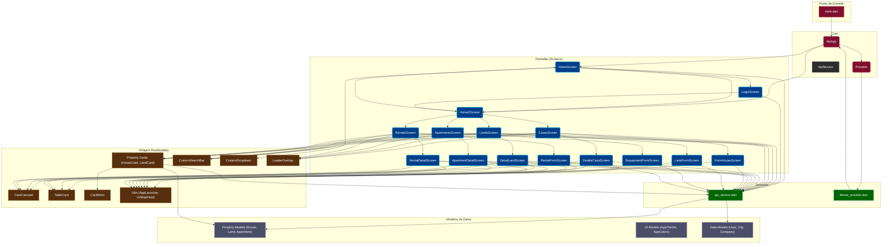

# Mi Terrenito App

Aplicación móvil para la visualización y gestión de propiedades inmobiliarias.

## Diagrama de Arquitectura

```mermaid
graph TD
    subgraph "Punto de Entrada"
        A[main.dart]
    end

    subgraph "Core"
        B(MyApp)
        C(Provider<ThemeProvider>)
        D[ApiService]
    end

    subgraph "Modelos de Datos"
        M1["Property Models (House, Land, Apartment)"]
        M2["UI Models (AppTheme, AppColors)"]
        M3["Data Models (User, City, Company)"]
    end

    subgraph "Servicios"
        S1[api_service.dart]
        S2[theme_provider.dart]
    end

    subgraph "Pantallas (Screens)"
        P1(HomeScreen)
        P2(LoginScreen)
        P3(Home2Screen)
        P4(CasasScreen)
        P5(LandsScreen)
        P6(ApartmentsScreen)
        P7(RentalsScreen)
        P8(DetalleCasaScreen)
        P9(DetailLandScreen)
        P10(ApartmentDetailScreen)
        P11(RentalDetailScreen)
        P12(FormHouseScreen)
        P13(LandFormScreen)
        P14(DepartmentFormScreen)
        P15(RentalFormScreen)
    end

    subgraph "Widgets Reutilizables"
        W1["Property Cards (HouseCard, LandCard)"]
        W2[CustomSearchBar]
        W3[CustomDropdown]
        W4[CardCarrusel]
        W5[TableCard]
        W6[LoaderOverlay]
        W7[CardMixin]
        W8["Utils (AppLauncher, UrlMapField)"]
    end

    %% Conexiones
    A --> B
    B --> C
    B --> P1
    B --> P3

    C --> S2
    S2 --> B

    P1 --> S1
    P1 --> W3
    P1 --> P2
    P1 --> P3

    P2 --> S1
    P2 --> P3

    P3 --> P4
    P3 --> P5
    P3 --> P6
    P3 --> P7
    P3 --> P1

    P4 --> S1; P4 --> W1; P4 --> W2; P4 --> W6; P4 --> P8; P4 --> P12
    P5 --> S1; P5 --> W1; P5 --> W2; P5 --> W6; P5 --> P9; P5 --> P13
    P6 --> S1; P6 --> W1; P6 --> W2; P6 --> W6; P6 --> P10; P6 --> P14
    P7 --> S1; P7 --> W1; P7 --> W2; P7 --> W6; P7 --> P11; P7 --> P15

    P8 --> S1; P8 --> W4; P8 --> W5; P8 --> W8
    P9 --> S1; P9 --> W4; P9 --> W5; P9 --> W8
    P10 --> S1; P10 --> W4; P10 --> W5; P10 --> W8
    P11 --> S1; P11 --> W4; P11 --> W5; P11 --> W8

    P12 --> S1; P12 --> W8
    P13 --> S1; P13 --> W8
    P14 --> S1; P14 --> W8
    P15 --> S1; P15 --> W8

    S1 --> M1
    S1 --> M3

    W1 --> W7
    W1 --> S1
    W1 --> M1

    classDef default fill:#2d2d2d,stroke:#333,stroke-width:2px,color:#fff;
    classDef screen fill:#023e8a,stroke:#00b4d8,color:white;
    classDef service fill:#006400,stroke:#2e8b57,color:white;
    classDef widget fill:#582f0e,stroke:#7f4f24,color:white;
    classDef model fill:#4a4e69,stroke:#9a8c98,color:white;
    classDef entry fill:#800f2f,stroke:#a4133c,color:white;

    class A,B,C entry
    class P1,P2,P3,P4,P5,P6,P7,P8,P9,P10,P11,P12,P13,P14,P15 screen
    class S1,S2 service
    class W1,W2,W3,W4,W5,W6,W7,W8 widget
    class M1,M2,M3 model
```
